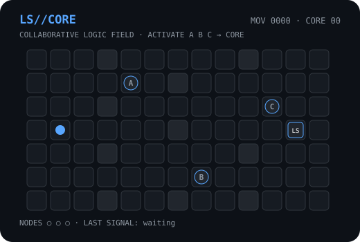

# Lucas Sudati

**Engenharia de Computação · Matemática · Tecnologia**

Licenciado em **Matemática**, **Técnico em Informática** e acadêmico de **Engenharia de Computação**.

`Python` · `C` · `C#` · `JavaScript` · `Lua` · `MicroPython` · `RP2040` · `ESP32`

---

## LS//CORE

**Este perfil tem um estado global. Mova o sinal, ative A · B · C e alcance o núcleo LS.**

[⬆️ UP](https://github.com/LucasSudati/LucasSudati/issues/new?title=LSCORE%3AUP) ·
[⬅️ LEFT](https://github.com/LucasSudati/LucasSudati/issues/new?title=LSCORE%3ALEFT) ·
[➡️ RIGHT](https://github.com/LucasSudati/LucasSudati/issues/new?title=LSCORE%3ARIGHT) ·
[⬇️ DOWN](https://github.com/LucasSudati/LucasSudati/issues/new?title=LSCORE%3ADOWN)

Cada comando altera o mesmo circuito para todos os visitantes.

